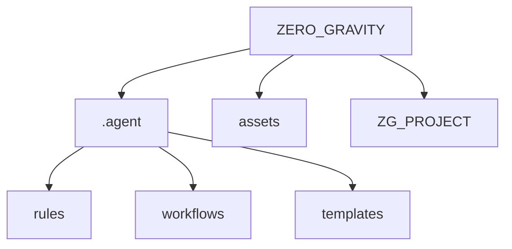

# ZERO_GRAVITY

> [!NOTE]
> Welcome to **ZERO_GRAVITY**.
> Where gravity is optional, and your code flies free.

[](https://github.com/Sunwood-ai-labs/ZERO_GRAVITY)
[](https://github.com/Sunwood-ai-labs/YOROZU)
[](LICENSE)

## Overview

**ZERO_GRAVITY** は、**GA-Workspace** (Google Antigravity Workspace) のメタフレームワーク・リポジトリです。
本プロジェクトは、従来の開発プロセスの制約（重力）から解放された、新しい開発体験を提供するための実験的プラットフォームであり、次世代のエージェント駆動型開発の基盤となります。

本ワークスペースは、**49以上の定義ファイル** から構成される高度なガバナンスモデルを内包しており、以下の「ゴールデントライアングル」を中心に自律的なプロジェクト運営を実現します：

1.  **Tech Stack Rule (`stack.md`)**: 技術選定の標準化
2.  **Operational Rule (`ops.md`)**: 運用プロセスの規定
3.  **Core Workflows**: 開発サイクルの自動化

## Features

GA-Workspaceは以下の原則に基づいて設計されています：

- **Recursive Composition (再帰的合成)**: ルールとワークフローの階層的な組み合わせにより、複雑なタスクを効率的に解決します。
- **Rule-based Governance (ルール駆動ガバナンス)**: `.agent/rules` に定義されたポリシーに従い、エージェントが自律的に判断・行動します。
- **Automated Workflows (ワークフロー自動化)**: `.agent/workflows` に定義された手順書に基づき、開発サイクル全体を自動化します。

## Included Capabilities

本リポジトリには、以下のルールとワークフローが事前設定されています。

### Rules (Governance)
| Category | Files |
|----------|-------|
| **Meta** | `ga-workspace-definition`, `project-governance`, `meta-rule-creation` |
| **System** | `stack`, `security-mandates`, `ops` |
| **Development** | `type-safety`, `react-components`, `testing-standards` |
| **Persona** | `character-rules-seira`, `japanese-rules` |

### Workflows (Automation)
| Category | Workflows |
|----------|-----------|
| **Setup & Core** | `/setup-ga-workspace`, `/create-repo-from-folder`, `/manage-agent-config` |
| **Development** | `/create-feature`, `/bug-fix`, `/refactor-legacy`, `/build-app-simple` |
| **Quality** | `/verify-code`, `/lint-check`, `/type-check`, `/run-tests`, `/security-scan` |
| **Release** | `/create-release`, `/git-auto-commit`, `/generate-header-image` |
| **Helper** | `/create-rule`, `/create-workflow`, `/generate-readme`, `/generate-unit-tests` |

## Directory Structure



### Governance Structure (.agent)

```plaintext
.agent
├── rules/                      # Agent Constitution
│   ├── 00-ga-workspace-definition.md
│   ├── 01-project-governance.md
│   ├── 02-stack.md
│   ├── 03-security-mandates.md
│   ├── 10-character-rules-seira.md
│   ├── ... (Total 20 rules)
├── workflows/                  # Standard Operating Procedures
│   ├── setup-ga-workspace.md
│   ├── git-auto-commit.md
│   ├── create-release.md
│   ├── verify-code.md
│   ├── ... (Total 27 workflows)
└── templates/                  # Artifact Templates
    └── release_notes_template.md
```

## Getting Started

このリポジトリは、新しいGA-Workspaceプロジェクトの **Source (雛形)** として機能します。

### 1. 新規プロジェクトの作成

```bash
# Agentワークフローによる初期化
/setup-ga-workspace
```

### 2. 既存プロジェクトのGA-Workspace化

```bash
# 対象ディレクトリの変換
/create-repo-from-folder
```

### 3. 環境の拡張

```bash
# 新規ルールの策定
/create-rule

# 新規ワークフローの定義
/create-workflow
```

## Related Projects

- **[YOROZU](https://github.com/Sunwood-ai-labs/YOROZU)**: The foundation of strict governance.

---

<p align="center">
  Generated by <b>ZERO_GRAVITY</b>
</p>
